## Knee Osteoarthritis Grading App ##

## Overview
    This project is an AI-powered web application built with Streamlit to grade knee osteoarthritis severity from X-ray images. It uses a binary classifier to verify if an uploaded image is a knee X-ray, followed by an ensemble of three deep learning models (DenseNet121, ResNet50, Xception) to predict the osteoarthritis grade: Healthy, Minimal, Doubtful, Moderate, or Severe. The app provides a user-friendly interface with a gradient-styled design and displays predictions with confidence scores and recommendations.Osteoarthritis is a chronic joint disease that results in the degeneration of cartilage and underlying bone, leading to pain, stiffness, and loss of mobility.Early detection is crucial in managing osteoarthritis (OA), as the disease's progression can be slowed or better managed with prompt intervention. There are several methods for diagnosing OA, such as X-ray examination, arthroscopic examination, and MRI examination. X-ray examination is widely available and affordable.The performance of image classification in deep learning has improved substantially because of increased computing power, large datasets that have been made available to the public, and the development of convolution neural networks (CNNs). Unlike conventional machine learning approaches, deep learning extracts and learns features from data on its own without human intervention. Hence, it is possible to make a more objective, consistent, and accurate diagnosis of knee OA using an automated measurement system that is based on deep learning.

## Public Datasets
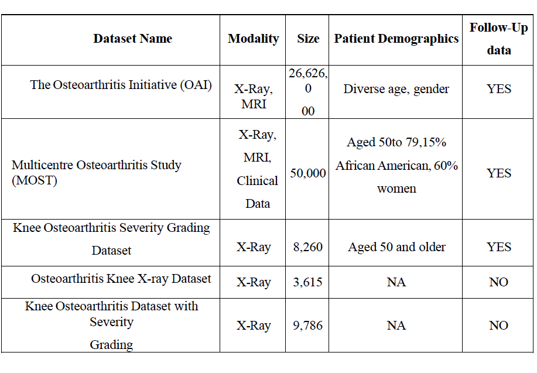

## Methodology
The methodology for knee osteoarthritis detection and severity classification includes the following steps:
### Data Collection:
The size of the datasets used for the project is 8,260 images from the source https://data.mendeley.com/datasets/56rmx5bjcr/1
           
### Data Augmentation & Preprocessing: 
            Apply preprocessing techniques like Contrast Limited Histogram Equalization for normalization, and augment data with rotation and horizontal flipping to enhance dataset diversity and ensure uniformity in image size.
        * Feature Extraction: 
            Use deep learning models (Xception, DenseNet121, ResNet50) to extract key features like bone structure and joint space from X-ray images for effective severity classification.
        * Ensemble Implementation: 
            Combine predictions from Xception, DenseNet121, and ResNet50 using a mix voting technique (hard and soft voting) to improve accuracy and robustness in OA detection.
        * Severity Detection: 
            Classify OA severity into five Kellgren-Lawrence grades (Healthy, Doubtful, Minimal, Moderate, Severe) based on structural changes in X-ray images.
        * Evaluation: 
            Assess model performance using metrics like accuracy, precision, recall, and support to ensure reliability and generalizability on unseen data.
        * Interpretation & Validation: 
            Use GradCAM to visualize influential image regions for predictions, ensuring transparency and alignment with radiological standards.

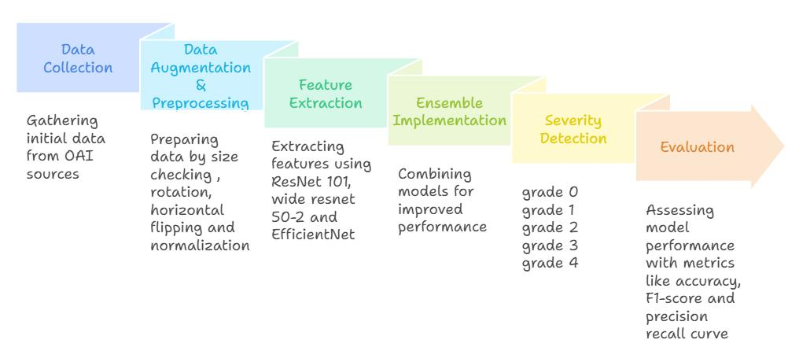

Preprocessing
    * preprocessing steps applied to the knee X-ray images to prepare for model training(find the required files in pre-processing folder):
        * Image Enhancement(): 
            Use Contrast Limited Histogram Equalization (CLAHE) to enhance contrast and standardize pixel intensity values, reducing variability across images.
            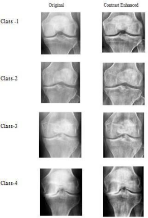
        * Noise removal:
            Median filter is effective against salt-and-pepper noise (random white and black pixels)
            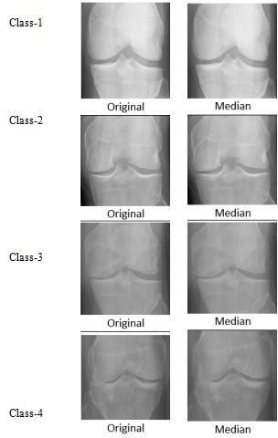
        * Data Augmentation: 
            Apply geometric transformations such as rotation (at various angles) and horizontal flipping to increase dataset diversity and improve model generalization.
        * Image Resizing: 
            Resize all images to a uniform size of 224x224 pixels to ensure consistency for model input.

Model Training
    * The training process for the deep learning models is summarized below:
        * Model Architectures: 
            Train five models— ResNet50, Xception, InceptionResNet V2, EfficientNet B0, and DenseNet121 —using transfer learning with pre-trained weights from ImageNet.
        * Fine-Tuning: 
            Make all layers trainable and add a custom classifier head with GlobalAveragePooling2D, Dropout (0.2), and a Dense layer with softmax activation for 5-class classification (Healthy, Doubtful, Minimal, Moderate, Severe).
        * Training Setup: 
            Use the Adam optimizer along with a dynamic learning rate scheduler (ReduceLROnPlateau) to adapt learning rates based on validation loss trends and train on a dataset of knee X-ray images labeled with Kellgren-Lawrence grades, leveraging data augmentation to handle class imbalance. Multiple experiments were conducted using a variety of batch sizes—4, 6, 8, 16, 32, and 256—selected based on GPU memory constraints and optimization efficiency. Similarly, different epoch settings (50, 100, and 150) were tested, with early stopping implemented based on validation loss to prevent overfitting and reduce unnecessary training time
        * Weights Saving: 
            Save model weights after training (e.g., 100 epochs org dataset DenseNet121_ft.hdf5, model_ResNet50_ft.hdf5, model_Xception_ft.hdf5) for reuse.

Evaluation
    * The performance of the models was evaluated using the following methods:
        * Metrics: 
            Assess models using accuracy (proportion of correct predictions), precision (ratio of correct positive predictions), recall (ratio of correctly identified positives), and support (number of instances per class).
            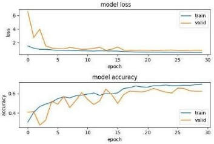
            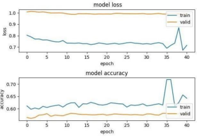
            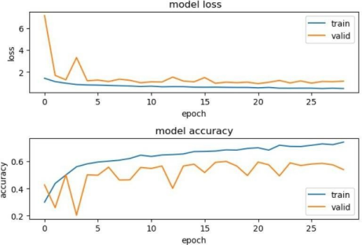
            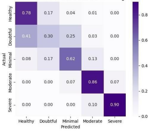
            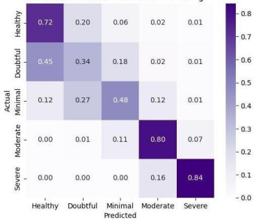
            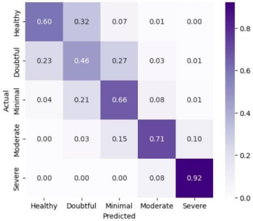

            
        * Validation: 
            Test on unseen data to ensure generalizability, using confusion matrices to analyze class-wise performance.
        * Interpretability: 
            Apply GradCAM to generate heatmaps, visualizing regions of the X-ray images (e.g., joint space, osteophytes) that influence predictions, ensuring alignment with radiological standards.
            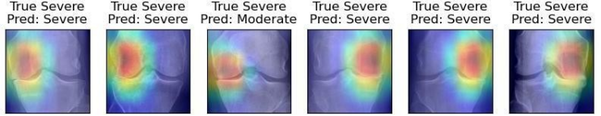
        

Deployment
    * The deployment process for the knee osteoarthritis detection system includes:
        * Model Saving and Loading: 
            Save trained model weights using model.model_ft.save(save_model_ft) and load them into reconstructed DenseNet121, ResNet50, and Xception models during deployment.
        * Ensemble Prediction: 
            Combine predictions from the three models by averaging their class probabilities, reducing variance and improving accuracy.
        * Streamlit App: 
            Deploy the ensemble model via a Streamlit web app, featuring a sidebar for image uploads, a main panel for displaying predictions (KL grade, confidence score, probability chart), and tailored recommendations (e.g., medications, physiotherapy).
            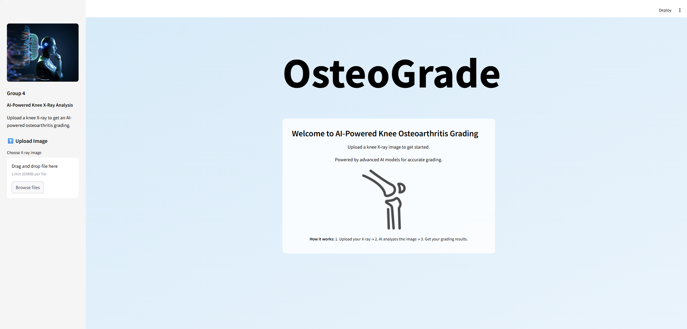
            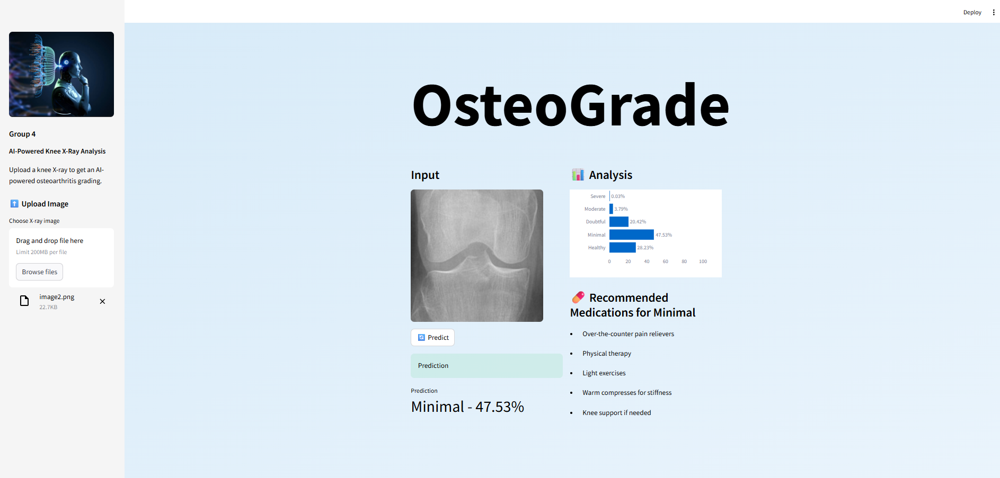
            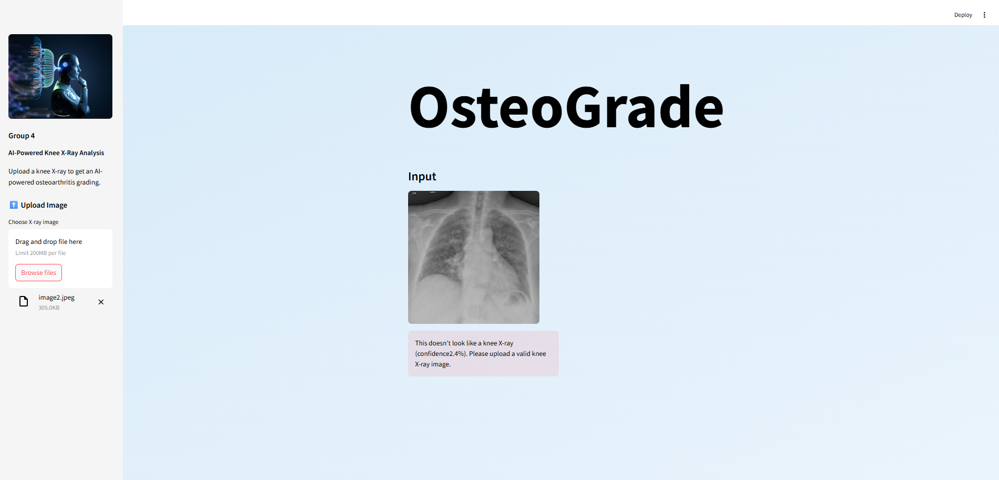
        * User Interaction: 
            Allow users to upload X-ray images (JPEG/PNG, up to 200 MB), trigger predictions with a "Predict" button, and view results with visual aids like a horizontal bar chart of probabilities.

Features

    * Knee X-ray Verification: A binary classifier ensures the uploaded image is a valid knee X-ray.
    * Ensemble Prediction: Combines DenseNet121, ResNet50, and Xception models for robust grading.
    * Interactive UI: Streamlit-based interface with a sidebar for image uploads and a two-column layout for input and analysis.
    * Visualizations: Displays prediction probabilities as a horizontal bar chart using Plotly.
    * Recommendations: Suggests precautions or medications based on the predicted grade.
    * Training and Testing Scripts: Includes scripts for model training (densenet121.py, ResNet50.py, etc.) and data handling (script to name the images in dataset-created for building a binary classifier (dataset.py)).

Prerequisites
    * Python 3.10/3.11
    * Conda (recommended for managing the virtual environment)
    * Model files: 
        knee_xray_classifier1.keras
        100 epochs org dataset DenseNet121_ft.hdf5
        model_ResNet50_ft.hdf5
        model_Xception_ft.hdf5
    * Icon file:
        mdc.png
    * dataset

Project Structure
    knee-osteoarthritis-grading/
    ├── app/
    │   ├── app.py             # Main Streamlit application
    │   ├── mdc.png            # Icon for the app
    ├── dataset/
    │   ├── auto_test/         #used for testing   
    │   ├── binary classifier dataset/      #used to train the classifier(custom dataset)
    │   ├── main dataset/       #main dataset used to train the models
    ├── Preprocessing/
    │   ├── CLAHE.ipynb            
    │   ├── mediafilter.ipynb 
    ├── src/
    │   ├── models/            # Directory for model files
    │   │   ├── 100 epochs org dataset DenseNet121_ft.hdf5
    │   │   ├── knee_xray_classifier1.keras
    │   │   ├── model_ResNet50_ft.hdf5
    │   │   ├── model_Xception_ft.hdf5
    │   ├── binaryclassifier_readme.txt.         # read me file for bainary classifier
    │   ├── binaryclassifier_testing_script.py         # testing script for bainary classifier
    │   ├── binaryclassifier.py         # testing script for bainary classifier
    │   ├── binaryclassifierdataset.py         # preprocessing of dataset script for bainary classifier
    │   ├── densenet121.py     # Training script for DenseNet121 model
    │   ├── densenet121_testing_script.py     # testing script for DenseNet121 model
    │   ├── efficientnetB0.py    # Training script for EfficientNet model (not used in app)
    │   ├── efficientnetB0_testing_script.py    # Testing script for EfficientNet model (not used in app)
    │   ├── inception_resnet_v2.py  # Training script for InceptionResNetV2 model (not used in app)
    │   ├── ResNet50.py        # Training script for ResNet50 model
    │   ├── resnet_testing_script.py            # testing Script for resnet model
    │   ├── Xception.py        # Training script for Xception model
    │   ├── Xception_testing_script.py        # Testing script for Xception model
    ├── README.md              # Project documentation

usage:
    * clone the repo
    * install conda or miniconda
        bash Miniconda3-latest-MacOSX-arm64.sh
        or 
        use the website to download
    * create virtual environment
        conda env create -f environment.yml
        or
        conda create --name myenv python=3.10
    *activate environment
        conda activate myenv
    * To deactivate an active environment
        conda deactivate
    * Install Dependencies
        pip install streamlit tensorflow numpy pillow plotly
    * change directory 
    * Run the Streamlit Web App
        streamlit run app/app.py
        This opens the app in your default browser (e.g., http://localhost:8501)
    * Upload an Image
        Use the sidebar to upload a knee X-ray image (PNG or JPEG).
        The app verifies if the image is a knee X-ray.
    * Get Predictions
        Click the "Predict" button to run the ensemble model.
        View the predicted grade, confidence score, and a bar chart of probabilities.
        See recommended precautions or medications based on the grade.
    * To stop the Streamlit app running in your terminal:
        Ctrl + C

Notes
    * Model Files: 
        Model files are large and not included in the repository. Contact the project maintainers to obtain them or train your own models using the scripts in src/.
    * File Paths: 
        The app uses absolute paths (e.g., C:\Users\Asus\Desktop\KOA_APP\src\models\). Update to relative paths (e.g., src/models/knee_xray_classifier1.keras) in app.py before running:
        model = load_model('src/models/knee_xray_classifier1.keras', custom_objects={'InputLayer': InputLayer})
    * Additional Scripts: 
        Scripts like efficientnet.py and inception_resnet_v2.py are included but not used in the app. They were likely used for experimentation.
    * Performance: Model loading and predictions may take time. Ensure at least 8GB RAM and a compatible GPU for faster inference.
    * If you encounter GPU-related errors, ensure TensorFlow is compatible with your GPU and drivers (e.g., CUDA, cuDNN).

Contributions are welcome! To contribute:
1. Fork the repository.
2. Create a new branch (`git checkout -b feature/your-feature`).
3. Make changes and commit (`git commit -m "Add your feature"`).
4. Push to your branch (`git push origin feature/your-feature`).
Please ensure your code follows PEP 8 style guidelines and includes tests where applicable.
